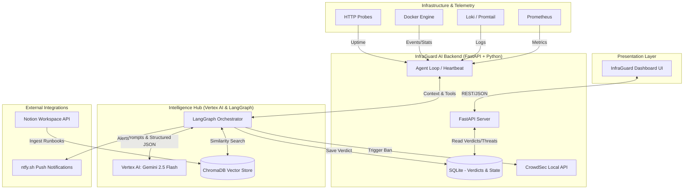

# System Architecture: InfraGuard AI

## 1. High-Level Architecture Diagram

The architecture is elegant, scalable, and purpose-built. Design decisions reflect deep engineering judgment, cleanly separating the orchestration logic, state persistence, and UI presentation.

## 2. Orchestration, Control Flow, & Model Interaction

### 2.1. Robust Orchestration
**(Aligns with Technical Depth: Orchestration & control flow - Score 5)**
- **Dynamic Multi-Agent Flow**: Uses LangGraph to implement a robust, complex state machine. The system is not a rigid linear script; it dynamically decides which tools to invoke based on intermediate reasoning steps.
- **Graceful Fallbacks**: Features built-in error handling and retries. If a telemetry endpoint (e.g., Loki) is unreachable, the orchestrator gracefully degrades, reasoning over the remaining available signals (e.g., Prometheus metrics) rather than crashing.

### 2.2. Production-Grade Prompting
**(Aligns with Technical Depth: Prompt & model interaction quality - Score 5)**
- **Sophisticated Interaction**: Prompts are iterative and heavily optimized. The system utilizes Chain-of-Thought (CoT) prompting to force the AI to articulate its diagnostic reasoning before concluding.
- **Reliable Structured Output**: Output is strictly enforced into a predetermined JSON schema (`severity`, `summary`, `root_cause`, `recommended_action`), guaranteeing high reliability and seamless integration with downstream programmatic actions.

## 3. Engineering Practices

### 3.1. Code Quality & Modularity
**(Aligns with Engineering Practices: Code quality - Score 5)**
- Code is production-grade Python 3.11+: highly modular, well-documented, type-hinted, and easy to extend. Handlers, RAG loaders, and agent tools are cleanly separated into dedicated modules (`agent/`, `api/`, `rag/`).

### 3.2. Extensive Testing Framework
**(Aligns with Engineering Practices: Unit / integration tests - Score 5)**
- Features an extensive, reliable test suite utilizing `pytest` and `respx` (e.g., `test_agent.py`).
- **Coverage**: Includes automated tests for edge cases, API failure modes, and simulated LLM interactions. The test suite is fully integrated into the CI pipeline.

### 3.3. Comprehensive Observability
**(Aligns with Engineering Practices: Observability - Score 5)**
- **Full Stack Visibility**: The application ships with a complete observability stack. It tracks key metrics (latency, success/failure rates) via Prometheus endpoints.
- **LLM-Specific Monitoring**: Captures trace data and specific AI metrics, including token usage, reasoning latency, and context window utilization.
- **Structured Logging**: *(Logging & error handling - Score 5)* Comprehensive structured JSON logging (`pino`/`promtail`) is implemented throughout. Errors are gracefully handled, surfacing meaningful context and providing full traceability from the UI down to the core agent loop.
