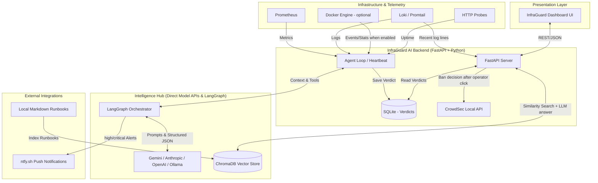

# System Architecture: InfraGuard AI

## 1. High-Level Architecture Diagram

The design cleanly separates orchestration logic (agent), state persistence (SQLite), and presentation (dashboard served by the API). The agent and API are independent containers sharing a SQLite volume, so the UI stays responsive regardless of AI processing load.

```mermaid
graph TD
    subgraph "Infrastructure & Telemetry"
        P[Prometheus]
        L[Loki / Promtail]
        D[Docker Engine - optional]
        H[HTTP Probes]
    end

    subgraph "InfraGuard AI Backend (FastAPI + Python)"
        AL[Agent Loop / Heartbeat]
        API[FastAPI Server]
        DB[(SQLite - Verdicts)]
        CS[CrowdSec Local API]
    end

    subgraph "Intelligence Hub (Direct Model APIs & LangGraph)"
        LG[LangGraph Orchestrator]
        LLM[Gemini / Anthropic / OpenAI / Ollama]
        RAG[(ChromaDB Vector Store)]
    end

    subgraph "External Integrations"
        RB[Local Markdown Runbooks]
        NT[ntfy.sh Push Notifications]
    end

    subgraph "Presentation Layer"
        UI[InfraGuard Dashboard UI]
    end

    %% Telemetry Flow
    P -->|Metrics| AL
    L -->|Logs| AL
    D -->|Events/Stats when enabled| AL
    H -->|Uptime| AL

    %% Orchestration Flow
    AL <-->|Context & Tools| LG
    LG <-->|Prompts & Structured JSON| LLM
    RB -->|Index Runbooks| RAG
    API <-->|Similarity Search + LLM answer| RAG

    %% Action & Storage
    AL -->|Save Verdict| DB
    LG -->|high/critical Alerts| NT

    %% Threat Response (operator-approved)
    L -->|Recent log lines| API
    API -->|Ban decision after operator click| CS

    %% UI Flow
    UI <-->|REST/JSON| API
    API <-->|Read Verdicts| DB
```

## 2. Orchestration, Control Flow, & Model Interaction

### 2.1. Orchestration
- **LangGraph state machine**: each heartbeat runs `collect → analyze → decide → notify`. The notify edge is conditional (only `high`/`critical` verdicts page the operator via ntfy.sh); the decide step gathers Docker container diagnostics on `high`/`critical` when Docker monitoring is enabled.
- **Two reasoning modes**: `USE_LANGCHAIN_AGENT=1` runs a LangChain tool-calling agent (Gemini decides which of the Loki/Prometheus/HTTP-probe tools to invoke, up to 6 iterations). The default mode makes a single structured Gemini call over pre-assembled telemetry. Every stored verdict records which mode produced it (`llm_mode`).
- **Graceful degradation**: every tool returns a structured `ok: False` error instead of raising. If a telemetry endpoint (e.g. Loki) is unreachable, the orchestrator reasons over the remaining signals; if the LLM call itself fails, a fallback `warning` verdict is stored so the operator sees the pipeline is degraded rather than silently missing data.

### 2.2. Prompting & Structured Output
- **Scope-bounded prompts**: prompts instruct the model to assess only the telemetry sections present, and never to flag absent/optional integrations as incidents — this is the primary hallucination guard.
- **Reliable structured output**: responses are enforced into a fixed JSON schema (`severity`, `summary`, `root_cause`, `recommended_action`) with `response_mime_type=application/json`, severity whitelisting, and markdown-fence stripping as a fallback parser.

### 2.3. Threat Response (human-in-the-loop)
- The API scans up to 500 recent Loki lines for brute-force and port-scan patterns (regex + per-IP thresholds — deterministic, no LLM in the detection path).
- Detected threats render in the dashboard with a **Block IP** button. The CrowdSec ban decision is generated **server-side** from the threat fields and applied via the CrowdSec Local API only after the operator clicks — and runs in dry-run mode when CrowdSec is not configured. Auto-banning without human approval is deliberately not enabled.

## 3. Engineering Practices

### 3.1. Code Quality & Modularity
- Python 3.11+, type-hinted, modular: collection tools (`agent/tools/`), LLM clients (`agent/llm/`), RAG (`agent/rag/`), and the API (`api/`) are cleanly separated. Tools are thin, individually testable functions with structured error returns.

### 3.2. Testing
- `pytest` + `respx` suite covering tool parsing and failure modes, orchestrator routing (mocked LLM), API auth/staleness/threat endpoints, rate-limit enforcement, and SQLite retention. Tests run on every PR (`test.yml`) and gate deployment (`deploy.yml`).

### 3.3. Security & Observability
- **API hardening**: cookie sessions (itsdangerous-signed), enforced rate limits (60/min per IP, 5/min on login), security headers + CSP, and an audit log capturing every request (including unauthorized and rate-limited ones) with timestamp, IP, route, user, status, and latency.
- **Output hygiene**: all LLM- and log-derived text is HTML-escaped before rendering in the dashboard, since log content is attacker-influenced.
- **Operational visibility**: integration status chips (`/api/config`), a stale-agent banner driven by `/status` age tracking, and verdict history with severity filtering. Verdict storage is bounded by automatic retention pruning.
